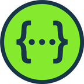
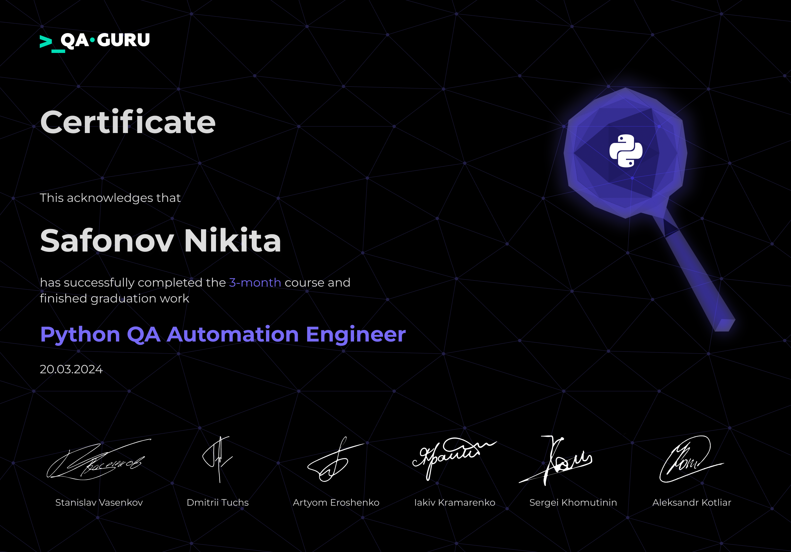

# Welcome here, I'm Nikita! 👋

## About me
- 👨‍💻 I'm manual and automation Engineer from Moscow.
- 🚀 I work QA over 2 years.
- 🐍 I write autotests in Python.
- 📬 Email: xicat5000@yandex.ru

  &#8287;&#8287;&#8287;&#8287;&#8287;
  
 &#8287;  
  
  &#8287;

&#8287;
## QA manual tools:

  
  <code></code>
  <code></code>
  <code></code>
  <code></code>
  <code></code>
  <code></code>
  <code></code>
  <code></code>
  <code></code>
  <code></code>
  <code></code>
  <code></code>
  <code></code>
  <code></code>
  <code></code>

&#8287;&#8287;&#8287;&#8287;
## QA automation languages and tools:

  <code></code>
  <code></code>
  <code></code>
  <code></code>
  <code></code>
  <code></code>
  <code></code>
  <code></code>
  <code></code>
  <code></code>
  <code></code>
  <code></code>
  <code></code>
  <code></code>
  <code></code>
  <code></code>
  <code></code>
  <code></code>
  <code></code>
  <code></code>

&#8287;&#8287;&#8287;&#8287;&#8287;
## Certificates:

<table width="100%" border='0'>
    <tr><td width="30%" valign="bottom"></td><td valign="middle">QA automation engineer school <a target="_blank" href="https://qa.guru">qa.guru</a>.</td></tr>
   </tr>
  </table>

&#8287;&#8287;&#8287;&#8287;&#8287;
## :bar_chart:Git stats

 

